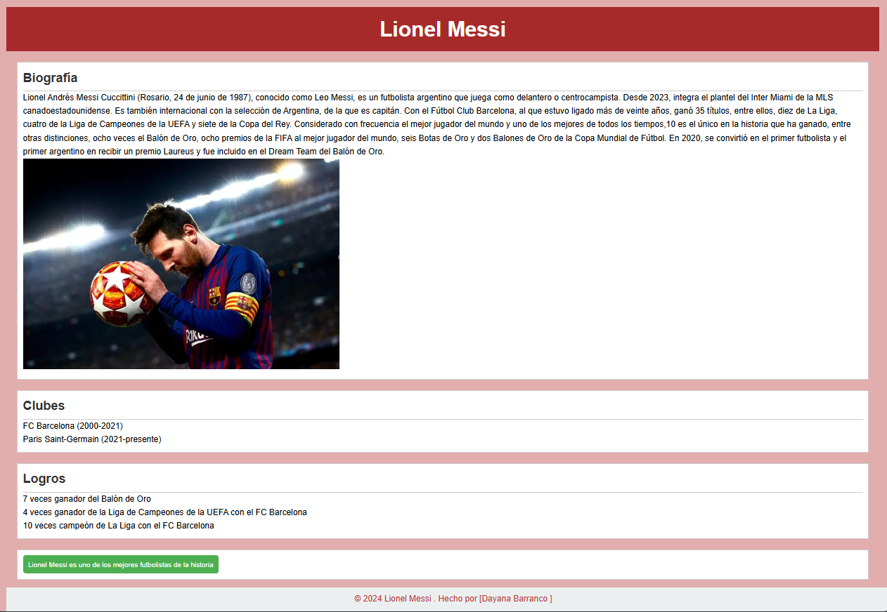
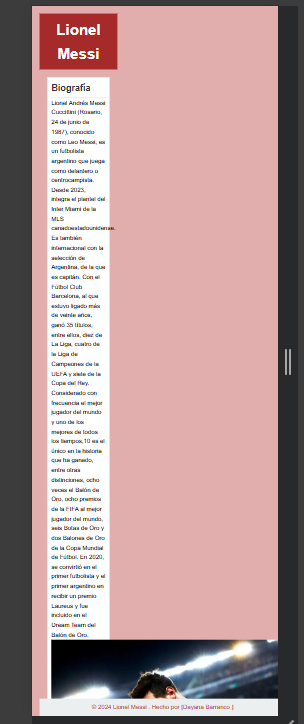

# ** lionel messi**

## descripcion

Reconocido por muchos como el mejor futbolista y uno de los mejores deportistas de todos los tiempos, ha ganado 44 títulos colectivos y más de 50 títulos individuales en su carrera. Es el jugador con más "Balones de Oro" y uno de los pocos en ganar una medalla de oro en los juegos olímpicos y un Mundial.

### portada en el escritorio

### portada en el celular

